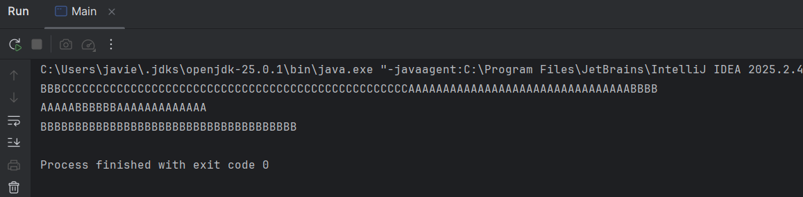
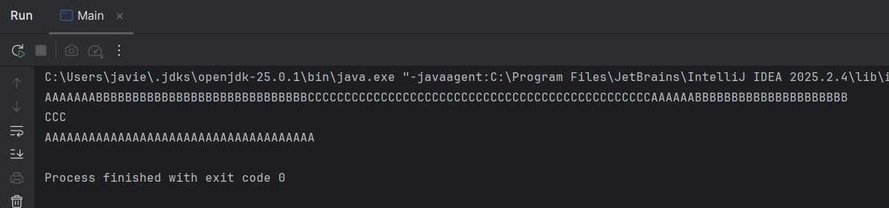

# Caso práctico 1: Programación multihilo

## Descripción
Programa en Java con 3 hebras. Cada una escribe por pantalla varias veces un carácter. El carácter y el número de repeticiones se pasan por parámetro en el constructor de la clase `Escritor`.

## Estructura del proyecto
- `Escritor.java`: hebra (extiende `Thread`) que escribe un carácter varias veces.
- `Main.java`: crea y lanza las tres hebras con `start()`.

## Cómo ejecutarlo
1. Abrir el proyecto en IntelliJ IDEA.
2. Ejecutar la clase `Main`.

## Ejemplo de salida

## Justificación del comportamiento observado

**¿Se mezclan las letras?** Sí. Las letras A, B y C aparecen entremezcladas en la consola y el orden cambia entre ejecuciones.

**Motivo:**
1. **Ejecución concurrente.** Cada `Escritor` es una hebra independiente; al llamar a `start()`, las tres avanzan a la vez.
2. **El planificador decide el orden.** La JVM y el sistema operativo reparten la CPU y pueden interrumpir una hebra en cualquier momento.
3. **Comportamiento no determinista.** El resultado depende de factores externos, por lo que cada ejecución es distinta.
4. **Recurso compartido sin sincronización.** Las tres escriben en `System.out` sin coordinación, así que sus caracteres se intercalan.
5. **Saltos de línea irregulares.** Cada hebra hace un `println()` al terminar, por eso el salto aparece donde acaba cada una.

**Cómo evitar la mezcla.** Con un bloque `synchronized` sobre un objeto común o ejecutando las hebras de forma secuencial con `join()`, a costa de perder la concurrencia.

**Conclusión.** La mezcla es consecuencia directa de la programación multihilo: las hebras corren en paralelo, comparten la consola y su orden es impredecible.